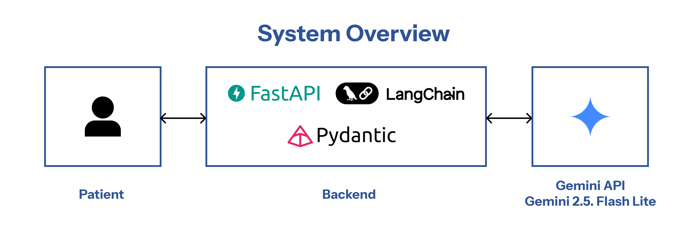

# Hospital Triage Department Recommendation API



LLM-powered patient triage and department recommendation system built using **FastAPI**, **LangChain**, and **Google Gemini**.

---

## Overview

This API accepts patient information (gender, age, symptoms) and uses a large language model from Google Gemini: Gemini 2.5 Flash to recommend the most likely hospital department that fit with the patient.

The system includes:

- FastAPI backend
- LLM-based reasoning using LangChain
- Validated I/O using Pydantic
- Custom prompt engineering for medical triage (The Prompt is Generated using LLM AI)

## Getting Started


1. Clone the repository
```
git clone https://github.com/RayhanAdii/triage-department-recommendation.git
cd triage-department-recommendation
```

2. Create a virtual environment
```
python3 -m venv .venv
source .venv/bin/activate
```

3. Install dependencies
```
pip install -r requirements.txt
```

4. Create a .env file with your Google API key
```
GOOGLE_API_KEY=your_google_api_key_here
```

5. Run the FastAPI server
```
uvicorn main:app --host 0.0.0.0 --port 8000 --reload
```

6. API is ready to use. Example using curl:
```
curl -X POST \
  http://localhost:8000/recommend \
  -H "Content-Type: application/json" \
  -d '{
        "gender": "female",
        "age": 62,
        "symptoms": ["pusing", "mual", "sulit berjalan"]
      }'

```
The API will be available at:
http://localhost:8000

## Future Development
- Implement RAG to make sure the recommendation is valid.
- Increase the amount of department covered.